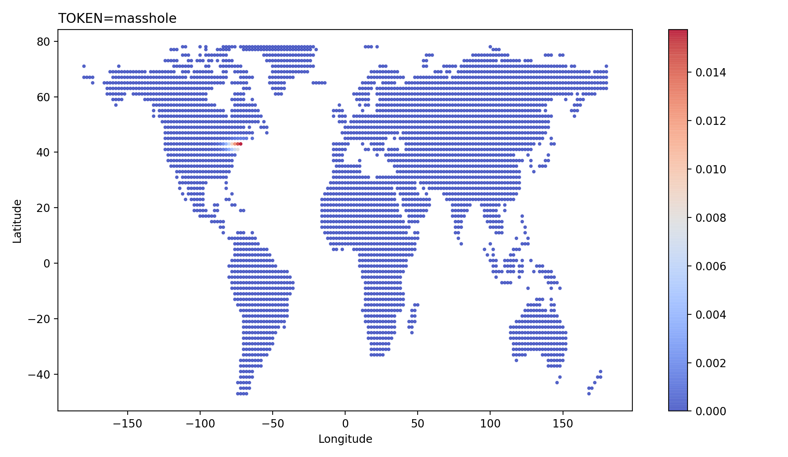

# Models

Upon completing the data usage agreement, you will receive two pretrained geolocation inference models. They should be stored in this directory.

* `models/reddit/US_TextSubredditTime/`: Contains model and associated data for inferring location of users in the contiguous United States. This model is useful if you are confident your sample of Reddit users lives within the contiguous United States.
* `models/reddit/Global_TextSubredditTime/`: Contains model and associated data for inferring locations of users around the entire world. This model is useful if you are not confident your sample of Reddit users only lives within the contiguous United States.

## Model Interpretation

One nice thing about the existing modeling architecture is our ability to understand the impact certain features (e.g. text tokens, subreddits) have on geolocation inferences. To do so, you can use the helper function associated with the pretrained models.

```
## Imports
import joblib
import matplotlib.pyplot as plt

## Load Model
model = joblib.load("models/reddit/Global_TextSubredditTime/model.joblib")

## Visualize Geographic Distribution of a Feature (using learned GMM)
feature = "TOKEN=masshole"
fig, ax = model.plot_model_posterior(feature)
plt.show()
```


